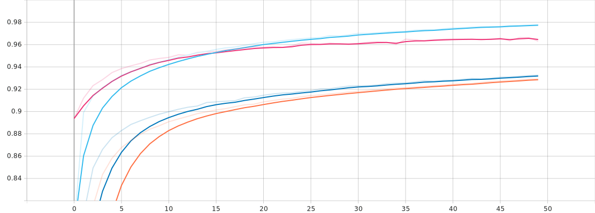
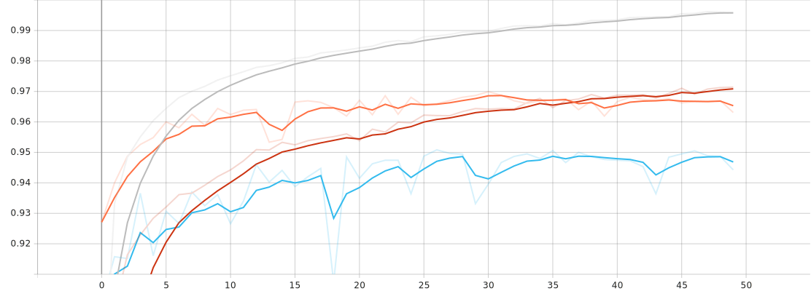
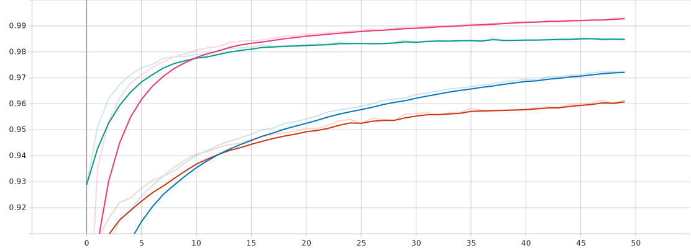
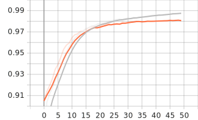

# Här är mina resultat hittils:

I den här filen ska ni beskriva:
- Era experiment
- Era slutsatser

## NOTE
    Vi har gjort våra tester främst på non-convolutional modellen, om inte frågan säger annat. Detta för att non-convolutional modellen tar betydligt kortare tid att träna, vilket möjliggör fler ändring på parametrar (så som batch size, lager av neuroner, antal neuroner, etc).

## 7
### a) 
    En högre learning rate innebär att varje epok har en högre vikt och då i teorin gör att modellen tränas snabbare. Men en för hög learning rate gör att resultaten uppdateras för mycket och modellen (kan) hamna på en sub-optimal lösning.
    Bilderna under visar learning rate 0.01 vs 0.1 och 0.5 vs 0.9
    

### b)
    Generellt så innebär en mindre batch size att du behöver göra färre uppdateringar för att uppnå en viss accuracy jämfört med en modell som har större batch size. Mindre batch sizes är ofta brusiga vilket innebär att det blir färre generaliseringsfel.
### c) 
    Convolutional modellen (CNN) är betydligt långsammare än non-convolutional. Med samma parametrar på båda modellerna uppnår CNN en högre accuracy. CNN modeller används främst för att minska komplexiteten för att processa data. Detta görs genom att filtrera bilden och minska dimensionerna. Genom att exempelvis stega igenom en 7x7 matris med en 3x3 kernel, så går vi från en 7x7 matris till 5x5 matris och därmed minskar komplexiteten. Detta kan upprepas. 

    Medan en non-convolutional modell (nCNN) går igenom varje pixel för sig.
    Nedan är en bild på skillnadena mellan dem två modollerna.

### d)
    non-convolutional model: Moved data accuracy: 14.74%
                             Rotated data accuracy: 80.12%
                             Test data accuracy: 96.17%
                             Train data accuracy: 97.2%

    convolutional model:     Moved data accuracy: 21.09%
                             Rotated data accuracy: 90.02%
                             Test data accuracy: 98.73%
                             Train data accuracy: 99.14%
    
    Generellt så har modellerna svårare att bedöma siffror som har flyttats än roterade siffror. Det är rimligt då det går att vrida en siffra tills den står "rätt". Medan det är svårare att veta vart en siffra finns om den inte är centrerad.

### e)
    Resultatet ökade när antalet neuroner ökade i det gömda lagret, upp till ungefär 300+, efter det blir förändring knappt märkbar.

### f)
Bilden nedan visar ett CNN där kernel är satt till (3,3). Precisionen var betydligt sämre på roterade siffror.

Bilden nedan visar ett CNN där strides är satt till (2,2)
")

### g)
    Ju fler lager som har lagts till -> träningstiden i sekunder ökar markant. Precisionen ökade något med fler gömda lager, gentemot samma antal neuroner i ett lager.
    Precisionen mellan 4st gömda lager och 6st gömda lager var i princip samma.

